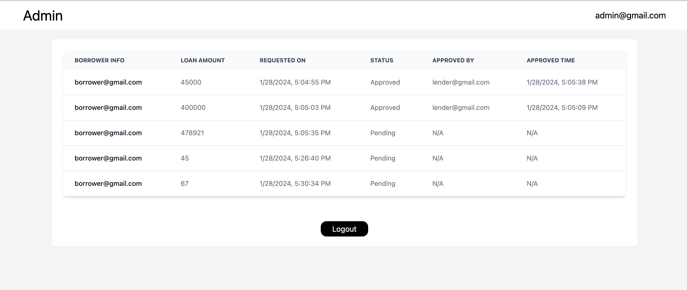

```bash
  Note- App is hosted on Galaxy cloud , it may take time to process
```
# EasyLone

An meteore app built for easy loan request with admin panel for better management and real time updation .


## Demo
live link - https://rudransh-mergerware.meteorapp.com/




## Setup

This project requires Meteor ,  ReactJS (version 16 or later) and NodeJS(14 or later) whch are really easy to install. To make sure you have them available on your machine, try running the following command.Try Volta for easily downgrading Nodejs

```bash
  npm -v
```

download meteor

```bash
  npm curl https://install.meteor.com/ | sh
```

set the environment variable in terminal if meteor is not recognised

```bash
  export PATH=/Users/rudranshkhandelwal/.meteor:$PATH
```

clone the project locally

```bash
  git clone https://github.com/ruds18/mergerware-assignment.git
```


```bash
   npm i 
```

Starting the meteor app

```bash
  meteor npm run dev
```


note - mongoDB is inbuilt , to access  add  url 'mongodb://127.0.0.1:3001/meteor' in mongoDb compass

Yay! now you are all set ! 👍 .

